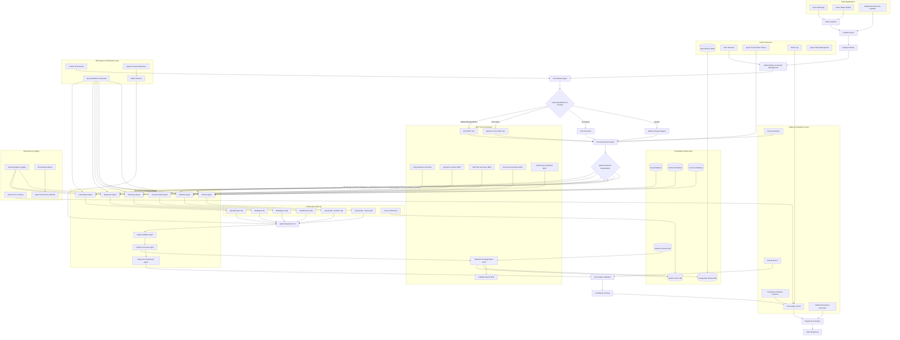

# HealthCare-Agent

## Architecture Overview

```mermaid
---
config:
  layout: fixed
---
flowchart TB
 subgraph subGraph0["Multi-Agent Orchestration Layer"]
        FF["CrewAI Orchestrator"]
        GG["Ray Distributed Computing"]
        HH["Agent Communication Bus"]
        II["Redis Streams"]
  end
 subgraph subGraph1["Specialized Healthcare Agents"]
        M["Lab Analysis Agent"]
        N["Diagnostic Agent"]
        O["Pharmacy Agent"]
        P["Nutrition Agent"]
        Q["Fitness Agent"]
        R["General Health Agent"]
        T["Safety Validator Agent"]
        U["Evidence Checker Agent"]
        Z["Response Synthesizer Agent"]
  end
 subgraph subGraph2["LLM Models (Ollama)"]
        M1["OpenBioLLM-70B"]
        N1["BioMistral-7B"]
        O1["MedAlpaca-13B"]
        P1["Llama3-8B + Nutrition KB"]
        Q1["Llama3-8B + Fitness KB"]
        R1["OpenBioLLM-70B"]
        JJ["nomic-embed-text"]
  end
 subgraph subGraph3["MCP Tools Ecosystem"]
        G["OCR MCP Tool"]
        H["Speech-to-Text MCP Tool"]
        V["Medical Knowledge Base MCP"]
        Y["PubMed Search MCP"]
        KK["Drug Interaction Checker"]
        LL["Symptom Checker MCP"]
        MM["Diet Plan Generator MCP"]
        NN["Exercise Prescription MCP"]
        OO["Lab Results Interpreter MCP"]
  end
 subgraph subGraph4["Knowledge & Data Layer"]
        W[("Qdrant Vector DB")]
        X[("PostgreSQL Medical DB")]
        PP[("Medical Literature DB")]
        QQ[("Drug Database")]
        RR[("Nutrition Database")]
        SS[("Exercise Database")]
  end
 subgraph subGraph5["Safety & Compliance Layer"]
        CC["Final Safety Check"]
        TT["Medical Disclaimer Generator"]
        UU["Emergency Situation Detector"]
        VV["Privacy Sanitizer"]
        WW["Bias Detection"]
  end
 subgraph subGraph6["Monitoring & Logging"]
        XX["Structlog Agent Logging"]
        YY["Prometheus Metrics"]
        ZZ["Sentry Error Tracking"]
        AAA["Agent Performance Monitor"]
  end
 subgraph subGraph7["Data Persistence"]
        BBB[("SQLAlchemy ORM")]
        CCC["User Sessions"]
        DDD["Agent Conversation History"]
        EEE["Audit Logs"]
        FFF["Agent State Management"]
  end
 subgraph subGraph8["Client Applications"]
        GGG["React Web App"]
        HHH["React Native Mobile"]
        III["WebSocket Real-time Updates"]
  end
    A["Client Interface"] --> B["FastAPI Server"]
    B --> C["Request Router"]
    C --> D["Authentication & Session Management"]
    D --> E["Orchestrator Agent"]
    E --> F{"Input Classification & Routing"}
    F -- Medical Reports/PDFs --> G
    F -- Voice Input --> H
    F -- Text Query --> I["Text Processor"]
    F -- Images --> J["Medical Image Analyzer"]
    G --> K["Document Parser Agent"]
    H --> K
    I --> K
    J --> K
    K --> L{"Medical Domain Classification"}
    L -- Lab Results --> M
    L -- Symptoms/Diagnosis --> N
    L -- Medications --> O
    L -- Nutrition/Diet --> P
    L -- Exercise/Fitness --> Q
    L -- General Health --> R
    M --> M1
    N --> N1
    O --> O1
    P --> P1
    Q --> Q1
    R --> R1
    M1 --> S["Agent Response Pool"]
    N1 --> S
    O1 --> S
    P1 --> S
    Q1 --> S
    R1 --> S
    S --> T
    T --> U
    U --> V & Z
    V --> W & X & Y
    Z --> AA["Cross-Agent Validation"]
    AA --> BB["Confidence Scoring"]
    BB --> CC
    CC --> DD["Response Formatter"]
    DD --> EE["Client Response"]
    FF --> E
    GG --> M & N & O & P & Q & R
    HH --> II
    II --> S
    XX --> M & N & O
    YY --> AAA
    ZZ --> CC
    BBB --> X
    CCC --> D
    DDD --> K
    EEE --> CC
    GGG --> A
    HHH --> A
    III --> B
    JJ --> W
    PP --> V
    QQ --> O
    RR --> P
    SS --> Q
    KK --> O
    LL --> N
    MM --> P
    NN --> Q
    OO --> M
    TT --> DD
    UU --> CC
    VV --> K
    WW --> AA
```